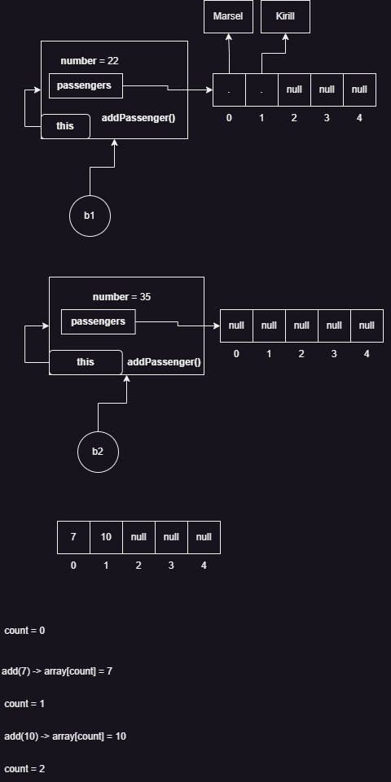

Задача на моделирование предметной области "Транспорт"

* Класс - абстрактный тип данных, шаблон на основе которого создаются `объекты`
* Объект - `конкретный` экземпляр класса, имеет `состояние` (`state`)
* Состояние объекта определяется значениями его полей (`fields`)
* Объектная переменная - переменная, которая содержит адрес реального объекта в памяти (указывает на него)

* Абстракция - набор значимых характеристик в контексте ремой задачи
* Инкапсуляция
  * Возможность защиты внутренней структуры (состояния) данных от некорректных значений
    * в java мы это может сделать с помощью модификаторов доступа
      * `private` - модификатор доступа, который обеспечивает уровень доступа `закрытый`
    * с помощью методов доступа
      * `геттеры` (`getters`) - для получения значений полей
      * `сеттеры` (`setter`) - для внесения значений в поля

* Конструктор - набор инструкций, которые инициализируют ваш объект
  * Инициализация - задание начальных характеристик созданного объекта
  * Конструктор - это не метод (!!!), конструкторы не наследуются
  * Если вы не определили свой конструктор, то Java добавляет свой пустой конструктор
  * Если вы написали свой конструктор (даже если он с параметрами), Java ничего не добавляет
  
* Если мы хотим, чтобы состояние объекта нельзя было менять на протяжении жизни этого объекта, то мы не делаем ему `setter`
  * Также, если мы не хотим, чтобы объект мог изменяться внутри методов самого объекта, то делаем поля `final`
  * Такие объекты называются `неизменяемыми` или `immutable`

* Ключевое слово `this`
  * Ссылка внутри объекта на самого себя
  * `this.fieldName` - обращение к полю
  * `this()` - вызов конструктора

## Домашнее задание

## Реализовать предметную область "Телевизор"

* Реализовать класс "Телевизор" - `TV`
* В телевизоре предусмотреть массив "Канал" - `Channel`
* В каждом канале предусмотреть массив телепередач - `Program`
* В канал можно добавить программу (по аналогии с добавлением пассажира в автобус)
* В телевизор можно добавить канал (по аналогии с добавлением пассажира в автобус)
* У программы есть название

* В main создать телевизор
* Создать три канала, в каждый положить три программы
* Все три канала положить в телевизор
* В телевизоре предусмотреть метод `on(int channelNumber)` - он у канала с номером channelNumber показывает случайную передачу